# Awesome-File-Activity-Monitoring

  

## 🔍 Similar Projects to File Activity Monitoring Platforms

**File Activity Monitoring** (also called File Integrity Monitoring / FIM, Data Access Governance, or File Server Auditing) tools track who accessed, modified, created, deleted, or changed permissions on files and folders. They are widely used for security, compliance (PCI-DSS, HIPAA, GDPR), insider threat detection, and forensic investigations. Leading commercial platforms include Varonis, Netwrix Auditor, ManageEngine ADAudit Plus, Quest Change Auditor, Lepide Auditor, Stealthbits, Egnyte Protect, SolarWinds Access Rights Manager, and PA File Sight.

Below is a **curated list** of notable platforms and their open-source equivalents. While commercial tools offer polished Windows/AD-centric dashboards and behavioral analytics, the open-source ecosystem provides powerful File Integrity Monitoring (FIM), host-based intrusion detection, and audit capabilities that can be combined into robust solutions.

## 🏢 SaaS / Hosted Platforms

| Product | Description | Pricing | Free Tier / Trial Limit | Company Size (Valuation / Revenue) |
| :--- | :--- | :--- | :--- | :--- |
| **[ManageEngine ADAudit Plus](https://www.manageengine.com/products/active-directory-audit/)** | Popular tool for Active Directory and file server auditing, change tracking, and compliance reporting. | Subscriptions start at $745/year for Standard Edition | Free Edition available (limited to auditing up to 25 workstations; stops collecting new data for servers after 30-day trial). | Valuation: ~$10B+ (Zoho Corp) / Revenue: ~$1B |
| **[Varonis](https://www.varonis.com/)** | Leading data security platform with deep file activity monitoring, permissions analysis, and threat detection across unstructured data. | Custom enterprise pricing (requires quote) | No free tier; offers a complimentary Data Risk Assessment & 30-day free trial. | Market Cap: ~$5.5B / Revenue: ~$500M+ |
| **[Quest Change Auditor](https://www.quest.com/products/change-auditor/)** | Real-time change auditing for Microsoft environments, including file systems and AD. | Custom enterprise pricing (requires quote) | No free tier; 30-day free trial. | Valuation: ~$5.4B / Revenue: ~$1B |
| **[SolarWinds Access Rights Manager](https://www.solarwinds.com/access-rights-manager)** | Permissions management and access rights auditing. | Custom enterprise pricing (requires quote) | 30-day fully functional free trial. Also offers a 100% free standalone Access Rights Auditor tool. | Market Cap: ~$1.8B / Revenue: ~$700M |
| **[Egnyte Protect](https://www.egnyte.com/)** | Content security and activity monitoring focused on cloud and hybrid file storage. | Paid plans (Secure & Govern) require custom quote | No free tier; 14-day free trial of the core platform (typically capped at 20GB). | Valuation: ~$1.5B+ / ARR: ~$200M+ |
| **[Netwrix Auditor](https://www.netwrix.com/)** | Comprehensive auditing solution for file servers, Active Directory, and other systems with strong reporting and compliance features. | Custom enterprise pricing (requires quote) | Free Community Edition (limited to reporting on changes in the last 24 hours). 20-day free trial of Enterprise Edition. | Valuation: ~$1.2B+ / Revenue: ~$150M+ |
| **[Stealthbits Auditor](https://www.stealthbits.com/)** (now part of Netwrix) | Data access governance and auditing solutions. | Custom enterprise pricing (requires quote) | No free tier; 20-day enterprise free trial. | Valuation: ~$1.2B+ (Netwrix) / Revenue: ~$150M+ |
| **[Lepide Auditor](https://www.lepide.com/)** | File server and AD auditing with permissions analysis and threat detection. | Custom enterprise pricing (requires quote) | No free tier; 20-day free trial of the full platform. | Revenue: ~$15M (Private) |
| **[PA File Sight](https://www.poweradmin.com/file-sight/)** | Real-time file access monitoring and auditing for Windows file servers. | Subscriptions start at $30/month per server | No free tier; 30-day fully functional free trial. | Revenue: ~$5M (Private) |

## 🔓 Open-Source Software

### 🛡️ Full Security Platforms with Strong FIM
- **[Wazuh](https://github.com/wazuh/wazuh)**  — The leading open-source XDR/SIEM platform. Includes powerful File Integrity Monitoring, real-time alerting, log analysis, vulnerability detection, and compliance reporting. Excellent agent-based coverage for Linux, Windows, and macOS. Highly recommended as a core open-source alternative.
- **[OSSEC](https://github.com/ossec/ossec-hids)**  — Classic open-source Host-based Intrusion Detection System (HIDS) with robust File Integrity Monitoring (Syscheck), log analysis, rootkit detection, and active response.
- **[Samhain](https://www.la-samhna.de/samhain/)** — Mature open-source file integrity monitoring and host-based intrusion detection system with centralized management options.

### ⚙️ Dedicated File Integrity & Auditing Tools
- **[Tripwire Open Source](https://github.com/Tripwire/tripwire-open-source)**  — Classic open-source file integrity monitoring tool (the original inspiration for many commercial FIM products).
- **[AIDE](https://github.com/aide/aide)**  (Advanced Intrusion Detection Environment) — Popular open-source file and directory integrity checker. Creates a database of file hashes and attributes and reports changes.
- **[AuditSphere](https://github.com/AuditSphere/AuditSphere)**  — Open-source file server auditing and monitoring solution for Windows and Linux. Tracks file add/remove/modify/rename/move, owner changes, and ACL changes with a central server and agents.
- Modern Rust/eBPF-based FIM tools (e.g., community projects like Achiefs/fim) that offer high-performance, real-time file monitoring with rich audit data.

### 🔌 Native & Supporting Tools
- **Linux auditd** + **auditbeat** / **auditd** rules — Native Linux auditing framework that can capture detailed file access and permission change events.
- **Sysmon** (Sysinternals) — Powerful Windows system monitor (free) that logs detailed file creation, process, and network activity (often paired with open-source collectors).
- **osquery** — SQL-powered operating system instrumentation that can query file events and integrity state.

### 🏗️ Typical Open-Source Stack
1. **Core monitoring & FIM** — Wazuh or OSSEC agents
2. **Integrity baseline & checking** — AIDE or Tripwire
3. **Centralized analysis & dashboards** — Wazuh Dashboard / OpenSearch / ELK stack
4. **Windows-specific detail** — Sysmon + Wazuh/Winlogbeat
5. **Custom file-server focus** — AuditSphere or custom auditd + log shipping

This combination provides real-time file activity visibility, integrity checking, alerting, and compliance reporting with full data ownership and no per-server licensing costs.

---

**🤝 How to contribute**  
Fork this repository, add a new project (with link + short description + category), and open a pull request.  
Prefer actively maintained open-source projects related to file activity monitoring, file integrity monitoring (FIM), data access auditing, or host-based intrusion detection.

**📄 License**  
This list is public domain / CC0. Feel free to copy into your own awesome list or README.

Star the projects you find useful — open security tools help organizations protect sensitive data without vendor lock-in! 🛡️
